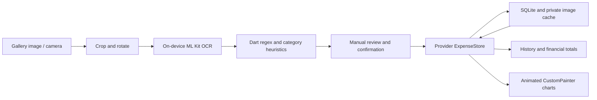
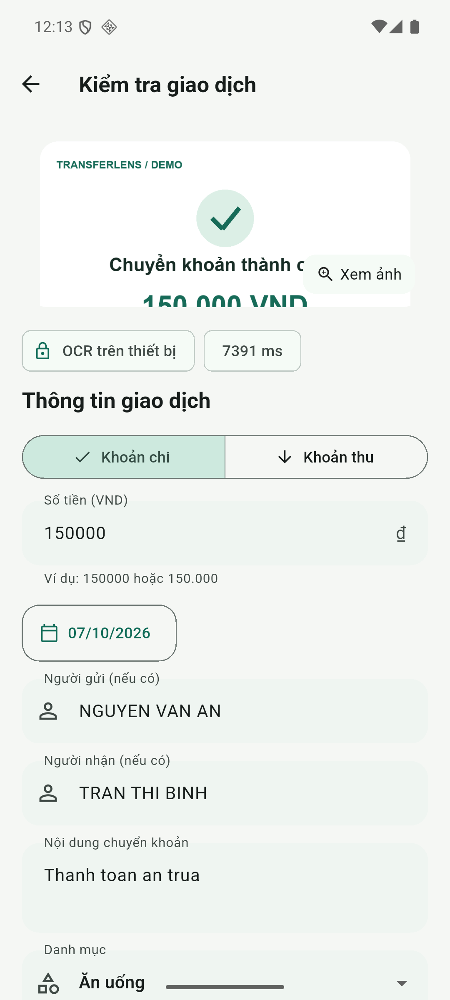
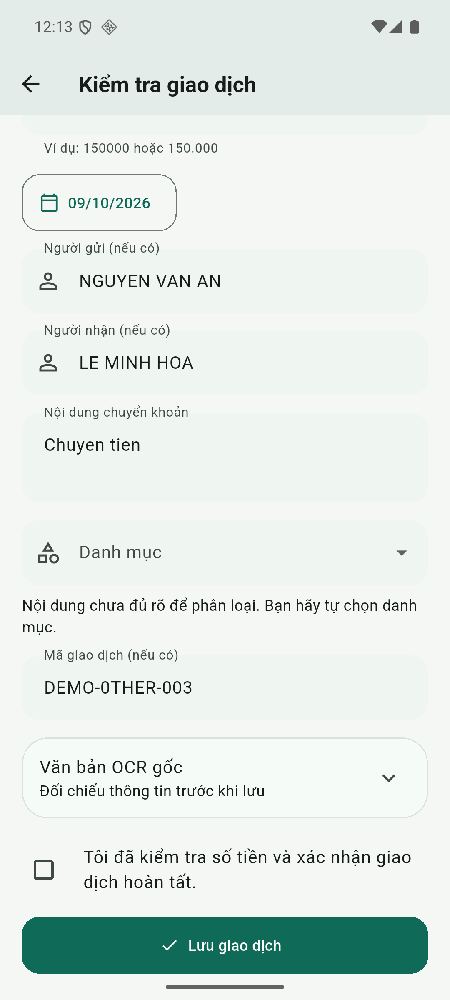
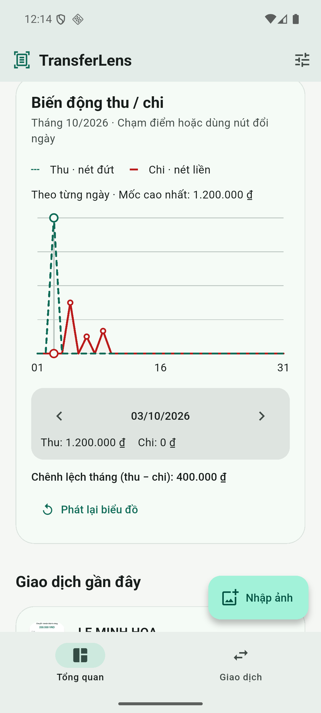
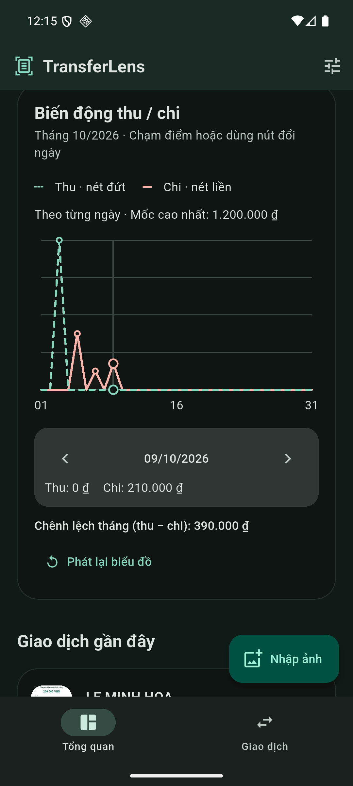

# MINI-PROJECT SHORT TECHNICAL REPORT
**Course:** Cross-Platform Mobile App Development (VKU) 
**Mini-Project Title:** Mini-Project 3 - TransferLens: OCR Expense Tracker & Transfer Parser 
**Team / Student Name:** Dương Bảo Đạt (individual project) 
**Submission Date:** 09/10/2026 
**Application Version:** 1.1.0

---

## 1. GENERAL INFORMATION & DELIVERABLE LINKS
* **Team Members:** Dương Bảo Đạt - Student ID: **23IT046** - Role: Full-stack mobile developer (architecture, implementation, testing and documentation) - Contribution: **100%**.
* **🔗 Live Demo URL:** [TransferLens on Cloudflare Pages](https://transfer-lens.pages.dev/) - mobile-friendly interactive preview, native demo video and Android installation instructions. The browser preview uses fictional data; actual image OCR runs in the Android APK.
* **Signed APK:** [Download app-release.apk](https://github.com/duongdatdev/transfer-lens/releases/download/v1.1.0/app-release.apk).
* **💻 GitHub Repository:** [duongdatdev/transfer-lens](https://github.com/duongdatdev/transfer-lens).
* **🎥 Video Demo:** [Download the 2-minute 36-second demonstration](https://github.com/duongdatdev/transfer-lens/releases/download/v1.1.0/transfer-lens-demo.mp4).
* **Technical Report PDF:** [Download the four-page report](https://github.com/duongdatdev/transfer-lens/releases/download/v1.1.0/transfer-lens-report.pdf).

**Adapted problem scenario:** The user imports an image saved after a successful bank transfer instead of a paper receipt. Offline OCR extracts the amount, date, labeled sender/recipient, transfer description and reference. Description keywords suggest an expense category; unclear or conflicting descriptions require manual selection. The user reviews and confirms all information before saving. Optional camera capture remains available. This adaptation follows the requested transfer-image scenario; acceptance of the changed input by the instructor has not been established.

---

## 2. FEATURE IMPLEMENTATION CHECKLIST
| # | Required Feature | Status | Implementation Details & Acceptance Level |
|:---:|---|:---:|---|
| 1 | Image input and cropping | Implemented | Import a transfer screenshot using the system photo picker; crop/rotate before OCR. Optional live camera includes flash, tap focus and a framing overlay. Physical-device camera/gallery acceptance remains pending. |
| 2 | On-device text recognition | Validated on emulator | Bundled Google ML Kit Latin recognition performs actual offline OCR. Four fictional transfer images were scanned in the native walkthrough. The sub-100ms target has not been demonstrated. |
| 3 | Regex and heuristic extraction | Validated | Extract VND amount, calendar date, explicit sender/recipient, description and reference. Ignore balance/fee/account numbers; unresolved or conflicting fields remain editable. |
| 4 | Classification and review | Validated | Suggest Food, Study, Travel, Gear or Entertainment from accent-normalized description phrases; provide Other and manual selection. Require valid amount/date/category and explicit confirmation; warn about duplicates and failed/pending transfers. |
| 5 | Provider and SQLite transaction lifecycle | Validated | Create, read, update and delete records; persistence verified by database reopening. Cache originals and thumbnails in private application storage and clean files after deletion or a failed save. |
| 6 | Custom canvas visualizations | Validated | Animated monthly category donut, weekly spending bars and daily income/expense trend use CustomPainter without chart packages. Support selection, replay, smooth updates and reduced motion. Donut/bars show expenses only; the trend separates income and expenses. |
| 7 | Material 3 and responsive UI | Validated by widget tests | Persist light/dark/system theme; verify 375px, landscape/tablet, 200% text scale and reduced motion. Manual correction is available before saving and when editing history. |
| 8 | Submission package | Published; device check pending | Public repository with English Conventional Commits and build instructions; signed Android APK; native 2:36 demonstration; four-page PDF. Physical Android and iOS validation remain pending. |

---

## 3. TECHNICAL ARCHITECTURE & PROJECT STRUCTURE
**Stack:** Flutter 3.47.5, Dart 3.13.4, Provider, sqflite, Google ML Kit text recognition, image_picker, image_cropper and camera. Android release targets SDK 36 and supports API 24+; iOS configuration requires macOS/Xcode validation.

| Directory / module | Responsibility |
| --- | --- |
| `lib/domain/` | Transaction model, transfer parser, category rules and calendar-day cash-flow aggregation. |
| `lib/data/` | SQLite repository, CRUD operations, database constraints and persistence. |
| `lib/services/` | Native OCR resource lifetime, original image storage and isolate-based thumbnail resizing. |
| `lib/state/` | Provider ExpenseStore, loading/error state, transaction notifications, duplicate checks and persistent theme. |
| `lib/ui/` | Material 3 dashboard, import, camera and review screens. |
| `lib/ui/widgets/` | CustomPainter donut, weekly bars and daily trend; animation and accessible selection controls. |
| `test/`, `integration_test/` | Parser/database/widget checks and real native OCR walkthroughs. |

**State and persistence flow:** OCR returns raw text and elapsed time. The parser creates an editable draft without inserting a transaction. After review, ExpenseStore caches the image, writes the transaction through the repository and refreshes shared state. History and charts recompute from persisted records. The daily trend animates income and expenses separately; its monthly net is recorded income minus expenses, not a bank balance.

**Exception handling:** Canceled image selection/cropping returns to the app. Invalid dates, ambiguous amounts and uncertain categories require user correction. Review data is captured before asynchronous saving; failed writes remove newly cached images. Deletion removes the database row before associated files. OCR/camera resources and animation controllers are disposed. Android backups are disabled; SQLite and images have no additional application-level encryption.

**Representative OCR rules:** The patterns below summarize the parser; validation and label scoring also apply.

| Field | Regex / heuristic after normalization | Review fallback |
| --- | --- | --- |
| VND amount | `\d{1,3}(?:[.,]\d{3})+` or plain digits; prefer `so tien` / `amount` labels; reject malformed grouping and exclude fee/balance/reference labels. | Missing or conflicting candidates require a manual amount. |
| Date | `(\d{1,2})[/.-](\d{1,2})[/.-](\d{4})`; validate actual calendar date and year 2000-2100. | Use the date picker for invalid/conflicting values. |
| Parties / description | Labeled fields such as `nguoi gui`, `nguoi nhan`, `noi dung`, including adjacent lines. | Unlabeled parties stay empty and editable. |
| Category | Accent-free whole phrases, for example `an trua`, `hoc phi`, `taxi`, `mua sam`, `xem phim`. | No unique category match requires manual selection. |
| Transfer status | Success indicators such as `thanh cong`, `successful`, `completed`; failed/pending indicators override success. | Display warnings and always require explicit human confirmation. |

---

## 4. EMPIRICAL EVIDENCE & SCREENSHOTS
The following four screenshots were captured from the native Flutter app on an **Android API 36 emulator**. Banking images contain fictional demonstration data.

<table>
  <tr>
    <td width="50%"><strong>A. Native OCR review</strong>  The imported image, measured OCR duration and editable amount appear before saving.</td>
    <td width="50%"><strong>B. Manual classification</strong>  A generic description has no confident keyword match, so the user selects a category.</td>
  </tr>
  <tr>
    <td><strong>C. Animated daily trend - light mode</strong>  Saved records produce dashed income and solid expense series. Select a date or replay the path reveal.</td>
    <td><strong>D. Updated trend - dark mode</strong>  Editing an amount updates the chart and monthly net; changing theme preserves the same financial data.</td>
  </tr>
</table>

**Verification results:** `flutter analyze` reported no issues; **41 unit/widget tests passed**. The native `integration_test/demo_test.dart` walkthrough exercised actual ML Kit OCR, review, incoming/outgoing records, chart replay/selection, edits and dark mode. Earlier v1.0.0 integration checks verified SQLite reopening, image/thumbnail storage, duplicate handling and deletion. The v1.1.0 signed main APK built successfully, passed signature verification and installed/cold-launched on the emulator. GitHub Actions passed for the published application commit.

**Observed cash-flow check:** Expenses of 150,000 + 450,000 + 200,000 VND total 800,000 VND; recorded income is 1,200,000 VND. Editing the last expense to 210,000 VND changes expenses to 810,000 VND and net recorded cash flow to 390,000 VND.

**Measured OCR durations in the recorded emulator walkthrough:** Other: 2,632 ms; Food: 7,391 ms; Study: 2,996 ms; Income: 3,675 ms. An earlier signed v1.0.0 offline smoke test measured 2,595 ms. These are observed emulator timings, not physical-device or sub-100ms performance results. See [verification evidence](docs/verification.md).

---

## 5. TECHNICAL CHALLENGES & RESOLUTIONS
1. **Ambiguous financial text and safe native OCR builds.** Bank images contain amounts, balances, fees, account numbers and reference codes with similar digits. The parser scores explicit amount labels, filters non-transaction fields, validates grouping/calendar dates and leaves conflicting results unresolved for review. Only explicitly labeled parties are extracted. Release shrinking initially affected reflectively constructed ML Kit component registrars; preserving their constructors allowed actual OCR to run in the signed release. Windows cross-drive Kotlin cache problems were resolved by disabling incremental Kotlin compilation. Parser tests and native OCR checks cover these behaviors.
2. **Animated charts that remain correct during edits and recording.** A new transaction or rapid edit can interrupt an animation. Daily values now interpolate from the current displayed frame, while `PathMetric.extractPath` reveals the trend progressively; leap-year and month boundaries are handled by calendar-day aggregation. AnimatedBuilder and RepaintBoundary isolate chart rendering. Reduced motion displays the final chart immediately. Integration screenshot conversion previously froze the recording surface between captures; host-side ADB screenshots and capture acknowledgements now preserve live animation in the 2:36 demo.

**Limitations and remaining acceptance checks:** Validate camera flash/focus, gallery/crop and real-bank image accuracy on a physical Android phone; benchmark OCR on that target. iOS has not been built/tested on Windows. OCR cannot verify that a payment actually occurred, and all records require human confirmation. No cloud OCR, bank API or automatic background synchronization is used. There is no claim that the original sub-100ms target has been achieved.

**Reproduction:** Follow the README for signing configuration and the Android toolchain. Run `flutter pub get`, `flutter analyze`, `flutter test`, then `flutter run -d <android-device>`. Build the signed artifact with `flutter build apk --release`. The technical report is regenerated using `python scripts/create_report.py`.

**References:** [Google ML Kit Android text recognition](https://developers.google.com/ml-kit/vision/text-recognition/v2/android); [Flutter ML Kit plugin](https://pub.dev/packages/google_mlkit_text_recognition); [Flutter CustomPainter API](https://api.flutter.dev/flutter/rendering/CustomPainter-class.html). Course references: Week 7 Part 1, rubric p.42; Week 8 Part 2, CustomPainter/animation pp.30-34, pipeline p.41, regex p.42 and deliverables p.43. This report retains the supplied template's five numbered sections.
