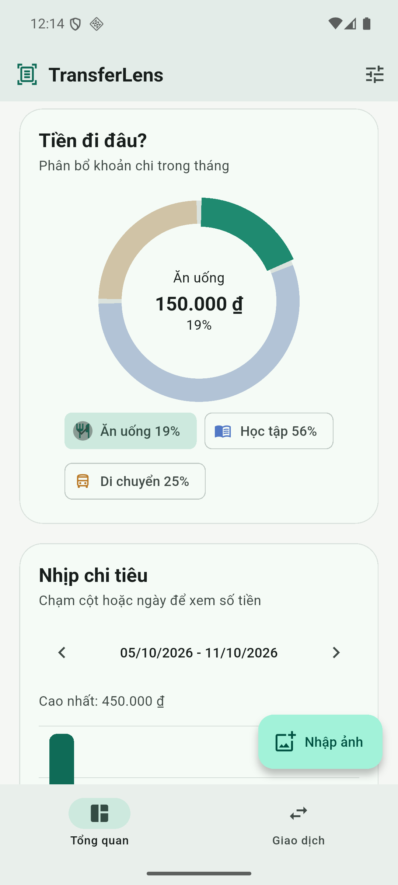
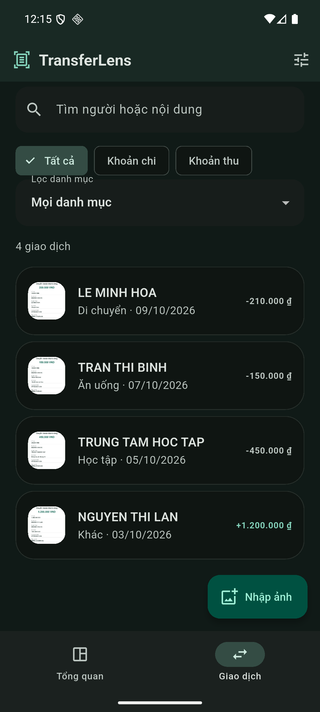

# TransferLens

**Mini-Project #3 - OCR Expense Tracker & Transfer Parser**

**Dương Bảo Đạt · 23IT046 · VKU · Individual project**

Turn a successful bank-transfer screenshot into a reviewed expense or income record.
Flutter + on-device Google ML Kit OCR + a Dart heuristic parser + SQLite + animated
`CustomPainter` charts. No account, banking connection, server, cloud OCR or chart library.

<p>
  
  
  
  
</p>

## Submission links

| Deliverable | Link |
| --- | --- |
| Public source | [GitHub repository](https://github.com/duongdatdev/transfer-lens) |
| Signed Android APK | [Download app-release.apk](https://github.com/duongdatdev/transfer-lens/releases/download/v1.1.0/app-release.apk) |
| 2-3 minute demonstration | [Download demo video](https://github.com/duongdatdev/transfer-lens/releases/download/v1.1.0/transfer-lens-demo.mp4) |
| 2-4 page report | [Download technical PDF](https://github.com/duongdatdev/transfer-lens/releases/download/v1.1.0/transfer-lens-report.pdf) |

The paper-receipt scenario has been adapted to user-provided **transfer confirmation
images**. Sender/recipient replace merchant names, and transfer descriptions drive
category suggestions. Optional camera capture remains implemented. See
[scope mapping](docs/submission.md), [architecture](docs/architecture.md) and
[Week 7-8 course alignment](docs/course-alignment.md).

## Features

- Import screenshots using the Android system photo picker; crop/rotate before OCR.
- Camera viewfinder, flash toggle, tap focus, framing overlay and post-capture crop.
- Bundled Latin ML Kit text recognition on Android, including offline first use.
- Extract VND amount, DD/MM/YYYY date, labeled sender/recipient, description and reference.
- Reject ambiguous amounts, ignore balance/account/fee numbers, flag failed/pending status.
- Suggest **Ăn uống / Học tập / Di chuyển / Mua sắm / Giải trí** from description keywords.
  Unknown or conflicting keywords require a manual category; **Khác** is available.
- Editable review, expense/income selection, explicit confirmation and duplicate warning.
- Persistent CRUD, private confirmation images and resized thumbnails.
- Animated monthly category donut and weekly spending bars, drawn directly on canvas;
  touch a segment/day or use labeled selection controls to inspect values.
- Animated daily income/expense line and area chart, with replay, date inspection and
  smooth live updates when amounts change. Solid/dashed lines distinguish the series;
  monthly net is recorded income minus expenses, not a bank balance.
- Search/filter history, navigate months/weeks, Material 3 light/dark/system themes.
- Four fictional sample images run through **real native OCR**, with measured latency.

## Run locally

Validated toolchain: **Flutter 3.47.5 / Dart 3.13.4**, Android SDK 36, Java 21.
The project uses Flutter 3.x, Dart 3 and Android API 24+.

```sh
git clone https://github.com/duongdatdev/transfer-lens.git
cd transfer-lens
flutter doctor
flutter pub get
flutter devices
flutter run -d <android-device-id>
```

Enable USB debugging on a physical Android device, or start an Android emulator.
Build a development APK with `flutter build apk --debug`. Release OCR and persistence
do not require Internet permission. Web/desktop are not OCR targets because the ML Kit
plugin supports Android/iOS only.

### Signed release APK

Create a private keystore outside the repository:

```sh
keytool -genkeypair -v -keystore /private/path/transfer-lens-release.jks \
  -storetype JKS -keyalg RSA -keysize 2048 -validity 10000 -alias transfer-lens
```

Copy `android/key.properties.example` to `android/key.properties`; set the absolute
keystore path, alias and passwords. On Windows use forward slashes in `storeFile`.
Passwords and keystores are ignored by Git. Preserve your signing key for future updates.

```sh
flutter build apk --release
```

Output: `build/app/outputs/flutter-apk/app-release.apk`. Release builds require a
release signing configuration; the project does not silently use a debug key.

### iOS

iOS source is configured for **15.5+**, camera/photo-library permissions and CocoaPods.
On macOS install Xcode/CocoaPods, run `flutter pub get`, `cd ios && pod install`, then
`flutter run -d <ios-device-id>`. iOS builds/device behavior have not been validated
from this Windows environment.

## Use the app

1. Tap **Nhập ảnh**, select a successful transfer confirmation, and crop away irrelevant UI.
2. Verify the extracted amount, date, sender and recipient against the image.
3. Choose **Khoản chi** or **Khoản thu**. Outgoing expense is the default; ownership is
   not inferred from a person's name.
4. Review the description-based suggestion, or choose a category yourself.
5. Tick the completion confirmation and tap **Lưu giao dịch**.
6. Inspect spending charts or search/filter **Giao dịch**; open a record to edit/delete it.

For a quick demonstration, choose **Bữa trưa**, **Học phí** or **Chuyển tiền** on the
import screen; **Tiền sinh hoạt** also demonstrates incoming transfers (select **Khoản thu**).
Samples use fictional names/references, not real banking credentials.

## Validation

```sh
dart format --output=none --set-exit-if-changed lib test integration_test tool
flutter analyze
flutter test
flutter test integration_test/app_test.dart -d <android-device-id>
```

Unit tests cover Vietnamese/English fields, grouped VND, invalid/ambiguous dates and
amounts, misleading account/fee/balance lines, status detection and category conflicts.
SQLite tests reopen an actual file database and verify CRUD/constraints. Widget tests
cover 375px phones, landscape and tablet, 200% text scaling, dark mode, required review
fields and interactive charts with reduced motion. The integration test exercises
native ML Kit, editable review, image caching, persistence, duplicate detection and deletion.
GitHub Actions runs formatting, analysis and unit/widget tests on every push/PR.

The release-only manifest removes Internet, microphone and broad storage permissions
inherited from dependencies. `tool/release_smoke.dart` checks the native OCR/parser in
a signed, optimized release build; it is a separate test entry point and is not shipped
as the application entry point.

### Reproduce the deliverables on Windows

```sh
python -m pip install Pillow reportlab pymupdf imageio-ffmpeg
python scripts/generate_samples.py
python scripts/record_demo.py
python scripts/finalize_video.py
python scripts/create_report.py
```

The recording script uses a dedicated `emulator-5554` and an isolated demo database.
It captures actual screenshots while the integration test is still installed. Sample/report
generation uses the Windows Arial font. A condensed QA run is available with
`python scripts/record_demo.py --fast`; use the normal run for the submission video.
Screenshots are taken through ADB without replacing Flutter's render surface, so
the native screen recording retains live animations. Running the demo integration
test directly skips screenshot export; use the Python recorder to generate artifacts.

## Project structure

```text
lib/
  domain/       transaction model, VND/date parser, category heuristics
  data/         repository contract and SQLite implementation
  services/     native OCR and private image/thumbnail storage
  state/        Provider ExpenseStore and persisted theme
  ui/           dashboard, history, import, camera, editable review
    widgets/    CustomPainter donut, weekly bars and daily cash-flow trend
assets/samples/ fictional OCR images
test/           parser, SQLite and widget tests
integration_test/ native end-to-end validation
docs/           architecture, submission details and demonstration script
scripts/        reproducible sample artwork and deliverable generation
```

## Practical limits

- OCR is a heuristic aid, not a verification of payment or a bank integration.
- Names/layouts vary between banks. Unlabeled/missing names remain editable.
- Only VND integer amounts are supported. Fees are excluded from the main amount.
- OCR latency depends on device/image/model warm-up. The app displays measured
  processing time; **sub-100ms is not claimed as guaranteed**.
- Images and raw OCR can contain financial details. They remain app-private, with
  Android automatic backups disabled. Local SQLite/image files are not additionally encrypted.
- Camera/flash and real-world image accuracy need testing on the target physical phone.

## References

- [ML Kit Text Recognition for Android](https://developers.google.com/ml-kit/vision/text-recognition/v2/android)
- [Flutter ML Kit text-recognition plugin](https://pub.dev/packages/google_mlkit_text_recognition)
- [Image Cropper configuration](https://pub.dev/packages/image_cropper)
- [Flutter camera plugin](https://pub.dev/packages/camera)
- [Flutter CustomPainter API](https://api.flutter.dev/flutter/rendering/CustomPainter-class.html)
- [sqflite](https://pub.dev/packages/sqflite)

MIT license. Code comments and Conventional Commits are written in English.
