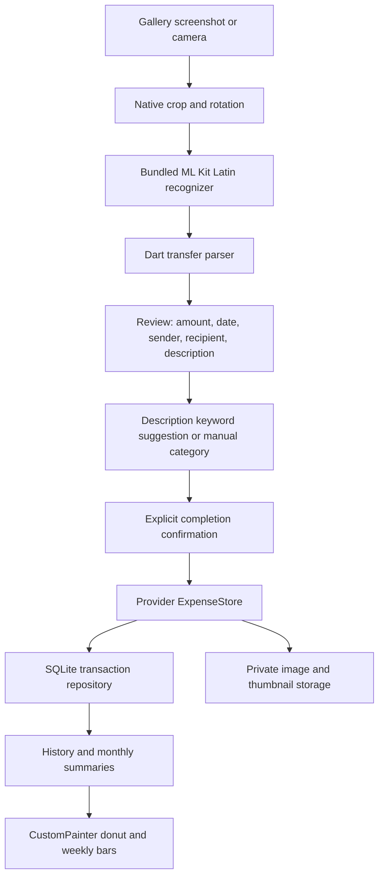

# Architecture

TransferLens adapts Mini-Project #3 from paper receipts to successful bank-transfer
confirmation images. This changes the input and extracted parties, while retaining
on-device OCR, heuristic parsing, editable review, local persistence and canvas charts.

## Module boundaries

| Module | Responsibility |
| --- | --- |
| `lib/domain` | Immutable transaction model, integer VND validation, Vietnamese/English parsing and category rules |
| `lib/data` | Repository interface and parameterized SQLite CRUD; schema constraints and indexes |
| `lib/services` | ML Kit resource lifetime, reading-order normalization, private image/thumbnail caching |
| `lib/state` | Provider ChangeNotifier, transactions, duplicate warning and persisted theme preference |
| `lib/ui` | Material 3 navigation, gallery/camera import, review, history and settings |
| `lib/ui/widgets` | Canvas-only animated charts with tap selection and accessible button alternatives |

## Parsing policy

- Never call a banking API or initiate a transfer. The image is a user-provided record.
- Prefer an amount adjacent to `Số tiền`/`Amount` over unlabeled currency values.
- Ignore balance, fee, account-number, reference and date/time lines for amount extraction.
- Equal-scoring conflicting amounts remain blank with a review warning.
- Accept grouped VND integers, reject malformed grouping and fractional VND.
- Validate calendar dates, including leap years; ambiguous dates require manual selection.
- Read explicitly labeled sender and recipient names. Unlabeled names are left for editing.
- Classify the description only, using accent-insensitive whole-word/phrase keywords.
- Conflicting or absent category keywords require a manual choice; `Khác` is available.
- Default to expense, since a transfer-success screenshot usually describes an outgoing
  transfer. The user explicitly selects income when importing an incoming transfer.
- Failed, pending or unknown status produces a warning. Saving always requires a human
  confirmation that the transfer was completed; OCR is not proof of payment.

## Persistence and failure handling

SQLite schema version 1 stores amount, date, direction, category, parties, description,
reference, raw OCR text, recognition duration and private image paths. Monetary amounts
are integers to avoid floating-point rounding. Charts aggregate expenses only; income
is shown separately. Monthly and weekly navigation use local calendar days.

New image files are copied only on save; thumbnails are resized in a background isolate.
If the database write fails, the new cache files are removed. Deletion removes the database
row first, then cleans up its cached images. A cleanup failure leaves an app-private orphan,
without falsely restoring a deleted transaction. Android backups are disabled to keep
transfer images out of automatic backups. SQLite and images are not additionally encrypted;
device access protections are still required.

Recognition, camera, picker, persistence and startup failures produce actionable UI
messages. Camera state handles app suspension and disposes the controller. OCR closes
the native recognizer after every import. Gallery recovery supports Android activity loss.

## Limitations

The Android APK is the validated release target. iOS permissions and minimum deployment
target 15.5 are configured, but iOS needs a macOS/Xcode build and device validation.
ML Kit is not supported on Flutter web/desktop, so there is no web OCR deployment.
The bundled Latin model operates offline. OCR accuracy and latency depend on device,
image clarity and bank layout; sub-100ms is a target, not a guaranteed result.

The release manifest explicitly removes dependency-added network, microphone and
broad storage permissions. A dedicated signed release smoke entry point verifies
that ML Kit still recognizes the bundled sample under this configuration. R8 rules
preserve the no-argument component registrar constructors required by ML Kit.
